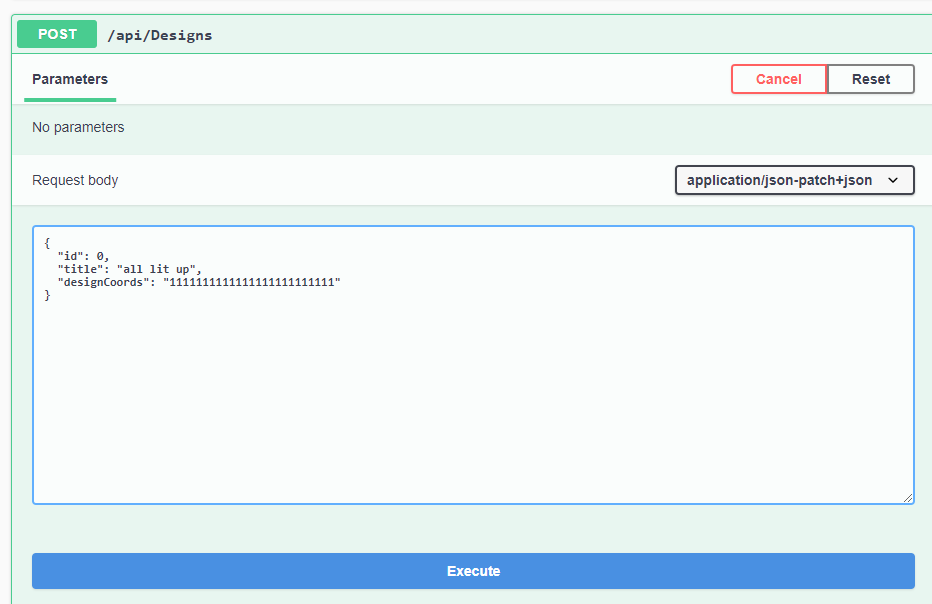
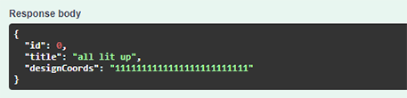
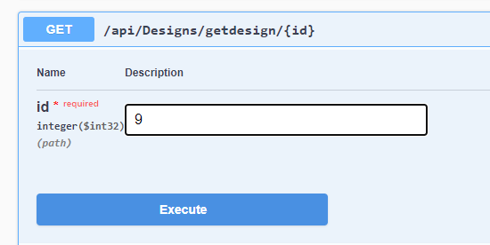
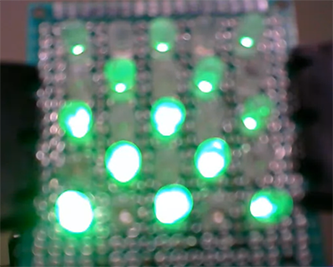
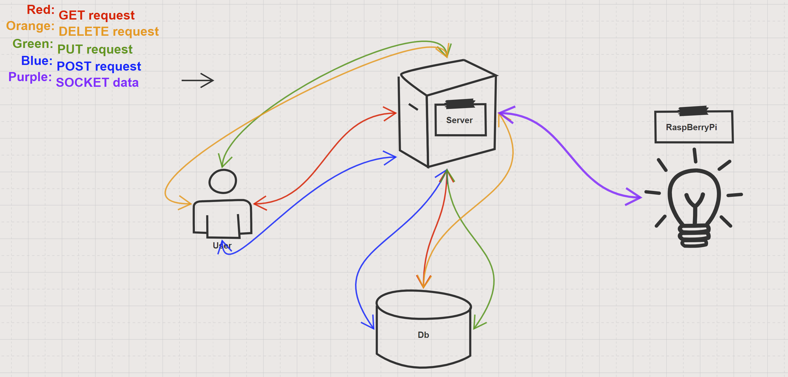
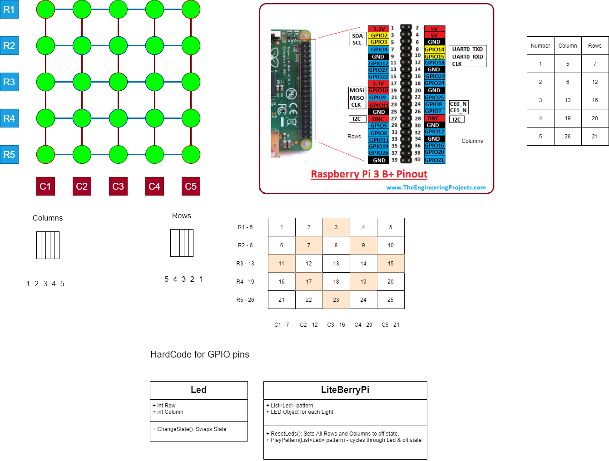

# LiteBerryPi

## Project Lite Berry Pi App
---
### We are deployed on Azure!
[SignalR Server](https://liteberrypisignalrserver.azurewebsites.net/)<br>
[GitHub Repository](https://github.com/4a50/Lite-Berry-Pi)<br>
[Api(SwaggerUI)](https://lite-berry-pi20210208174150.azurewebsites.net/index.html)<br>

---
## Table of Contents
+ [Tools Used](#tools-used)
+ [Getting Started](#getting-started)
+ [Usage](#usage)
+ [Data Flow](#data-flow)
+ [Data Models](#data-models)
+ [Model Props and Requirements](#model-properties-and-requirements)
+ [The RaspBerryPi Schematics](#the-raspberrypi-schematics)
+ [Change Log](#change-log)
+ [Authors](#authors)
+ [Attributions](#attributions)

---
## Web Application

LiteBerryPi provides a platform for people to show that they are present with others, when they aren't able to physically be there.

It is a unique way to communicate with others and show that a user cares in a fun way that isn't a text or email. Quarantining further limits social interactions, and Lite-Berry Pi will bring friends and loved ones together despite not being able to physically visit. 

LiteBerryPi is an ASP.NET Core restful API built on an MVC framework.  users can register and login via a SwaggerUI on the apps homepage.  Then use the generated token in postman to create and send designs!  

---

## Tools Used
Microsoft Visual Studio Community 2019 *(Version 16.8.3)*

+ 
+ 
+ 
+ Entity Framework
+ MVC
+ xUnit
+ Identity
+ SignalR
+ RaspBerryPi

---

## Getting Started

1. Clone the LiteBerryPi App and Server repositories.
  + **LiteBerryPi App**
  + `git clone https://github.com/Lite-Berry-pi/Lite-Berry-Pi.git`
  + **LiteBerryPi Server**
  + `git clone https://github.com/Lite-Berry-pi/lite-berry-pi-server`
2. From the power shell use `dotnet restore` to bring dependencies.
3. From the package manager command line migrate and update the database.
  + `Add-Migration initial`
  + `Update-Database`
4. For local use go to the `DesignsRepository`.
  + Under the `GetDesignToSend` method change the `url` to your local host + `/raspberrypi`.
  + The `RaspBerryPi` project goes on the RaspBerryPi client.
    + In `Program.cs` at the bottom of the main method change the `url` to your local host + `/raspberrypi`.
5. For live deployment publish the App and Server as seperate Azure apps.
6. Through the RaspBerryPi's command line turn the client on so it's listening for the server.

---

## Usage
+ Users can register and login with the SwaggerUI or via postman:
  + `https://lite-berry-pi20210208174150.azurewebsites.net/api/ApplicationUsers/Register`
  + `https://lite-berry-pi20210208174150.azurewebsites.net/api/ApplicationUsers/Login`

+ Anyone can see the designs and send existing designs via the SwaggerUI.
+ To create new designs you have to be logged in.  Login in with the API route above.  Use that bearer token on postman to authorize the POST request.
  + `https://lite-berry-pi20210208174150.azurewebsites.net/api/designs` to GET and POST designs.
  + `https://lite-berry-pi20210208174150.azurewebsites.net/api/designs/getdesign/{id}` to send a LiteBerry.

### Creating a LiteBerry Design



### Sending a LiteBerry Design


### The RaspBerryPi


---
## Data Flow


### ERD


+ User  1:many UserDesign
+ User  1:1  ActivityLog
+ UserDesign 1: many Design

---
## Data Models

### User Schema
*route:* `/api/user`
```
[
  {
    "id": 0,
    "name": "string",
    "activityLogs": [
      {
        "id": 0,
        "loginTime": "2021-02-10T23:22:44.804Z",
        "sendTime": "2021-02-10T23:22:44.804Z",
        "designs": [...],
      }
    "userDesigns": [
      {
        "id": 0,
        "title": "string",
        "designCoords": "string"
      }
    ]
  }
]
```
### Design Schema
*route:* `/api/design`
```
[
  {
    "id": 0,
    "title": "string",
    "timeStamp": "2021-02-10T23:48:54.091Z",
    "designCoords": "string",
    "userDesign": {...}
  }
]
```
### ActivityLog Schema
*route:* `/api/activitylog`
```
[
  {
    "id": 0,
    "loginTime": "2021-02-10T23:51:25.048Z",
    "sendTime": "2021-02-10T23:51:25.048Z",
    "designs": [...],
    "user": {...}
  }
]      
```
---
## Model Properties and Requirements

<table>
  <tr>
  <td>

  ### **User**
| Parameter | Type | Required |
| --- | --- | --- |
| Id  | `int` | YES |
| Name | `string` | YES |
| --- | --- | --- |
| ActivityLog | `List<ActivityLog>` | NAV |
| UserDesigns | `List<DesignDtos>` | NAV |

  </td>
  <td>
  
  ### **Design**
| Parameter | Type | Required |
| --- | --- | --- |
| Id  | `int` | YES |
| Title | `string` | YES |
| TimeStamp | `DateTime` | NO |
| DesignCoords | `string` | YES |
| --- | --- | --- |
| UserDesign | `UserDesign` | NAV |

  </td>
  </tr>
    <tr>
  <td>
  
  ### **ActivityLog** 
| Parameter | Type | Required |
| --- | --- | --- |
| Id  | `int` | YES |
| LoginTime | `DateTime` | NO |
| SendTime | `DateTime` | NO |
| --- | --- | --- |
| Designs | `List<Designs>` | NAV |
| User | `User` | NAV |

  </td>
  <td>
  
### **UserDesign**
*pure join table* 
| Parameter | Type | Required |
| --- | --- | --- |
| UserId  | `int` | --- |
| DesignId | `int` | --- |
| --- | --- | --- |
| Designs | `Design` | NAV |
| User | `User` | NAV |
  
  </td>
  </tr>
    <tr>
  <td>
  
  ### **ApplicationUserDto** 
| Parameter | Type | Required |
| --- | --- | --- |
| Id  | `int` | YES |
| Username | `string` | YES |
| Token | `string` | --- |
  
  </td>
  <td>
  
  ### **LoginData**
| Parameter | Type | Required |
| --- | --- | --- |
| Id  | `int` | YES |
| Username | `string` | YES |
| Token | `string` | --- |

  </td>
  </tr>
    <tr>
  <td>
  
  ### **RegisterUser**
| Parameter | Type | Required |
| --- | --- | --- |
| Username | `string` | YES |
| Password | `string` | YES |

  </td>
  <td>
  
### **UserDto**
| Parameter | Type | Required |
| --- | --- | --- |
| Id  | `int` | YES |
| Name | `string` | YES |
| --- | --- | --- |
| ActivityLog | `List<ActivityLog>` | NAV |
| UserDesigns | `List<DesignDtos>` | NAV |
  
  </td>
  <tr>
  <td>
  
  ### **DesignDto**
| Parameter | Type | Required |
| --- | --- | --- |
| Id  | `int` | YES |
| Title | `string` | YES |
| DesignCoords | `string` | YES |
| --- | --- | --- |
| UserDesign | `UserDesign` | NAV |
  
  </td>
  <td></td>
  </tr>
</table>
---

## The RaspBerryPi Schematics


---

## Change Log

### Version 1.5

+ *9/8/2021*
  + Basic front-end created with React
  + Created a clickable LED light matrix
  + Conversion from matrix to string  
+ *8/31/2021*
  + Consolidation of RaspberryPi, API/Database, and SignalR Server projects into single solution
  + Raspberry Pi
    + Streamlined display of LEDs
    + Added CLI Args: 
      + Bypass SignalR Connection
      + RaspberryPi initialization
      + Override URL
      + Perform display tests
    + added 'q' to quit program while in loop
    + added 't' to perform display test while in loop
    + separated SignalR and RaspberryPi initialization to separate classes
    + added Design class to create baked in designs/animations
    + moved createDesign method into Design class
    + moved display of LED method to Raspi class
  + API Project
    + Added Route to trigger baked-in designs on LiteBerry Pi    

### Version 1.0

+ *02/11/2021* - 
  + Assigned roles to users at time of registration.
  + Added permissions to the route controllers.
  + Added tests for translating a `string` to light Ids, creating a User and Design, and communicating with the Hub server.
+ *02/10/2021* - 
  + Made a new route in the design controller which makes a `GET` request to the design table, and sends that data to the server.
  + Brought in `Unitx` to write tests.
  + Created a mock database for the tests to run against.
+ *02/09/2021* - 
  + Database troubleshooting, nuked the whole thing and re-migrated.
  + Added `Identity` services to the app and assigned role permissions.
  + Built the client methods that take in the `string` from the server and unpacks it into usable data for the RaspBerryPi.
  + Added `SignalR` services for web socketing.  
  + Built and published a `HUB` to act as our server for sending LiteBerries.  
  + Opened the connection from the server to the RaspBerryPi client.
+ *02/08/2021* - 
  + Wired up the `ASP.NET Core` `MVC` Api App.
  + Built the model classes for the database and set up composite keys.
  + Seeded data to ensure the tables were being migrated and populated properly.
  + Created route controllers. `/user`, `/design`, `/activitylog`
  + Brought in `Swagger` and set the default app route to the `SwaggerUI`.
  + Built out `Interfaces` and created `services` for our routes.
  + Repository patterns made for all routes and CRUD actions.
  + Created Data Transfer Objects for front facing model views.
  + Published restful API to Azure.

---

## Authors
+ [JP Jones](https://github.com/4a50)
+ [Kjell Overholt](https://github.com/Overholtk)
+ [Krystian Francuz-Harris](https://github.com/KrystianFH)
+ [Michael Falk](https://github.com/MikeyFalk)
+ [Scott Falbo](https://github.com/scottfalbo)

## Attributions
+ Bade Habib
+ John Cokos